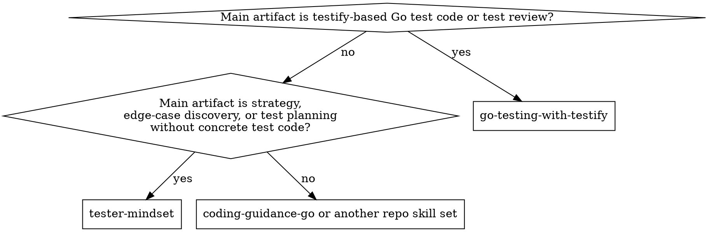

# Go Testing With Testify

Workflow for writing, reviewing, and hardening Go tests built on the standard
`testing` package and the `stretchr/testify` toolkit (`assert`, `require`,
`mock`, `suite`).

**Go+testify tests are checks** — automated pass/fail assertions on behavior
contracts. **Testing as investigation** — charters, heuristics, oracles under
stress, edge-case discovery, perspective rotation — is upstream. Compose with
`tester-mindset` when strategy, risk framing, or the shape of the unknown
dominates.

## When To Use

- writing new Go unit, integration, or HTTP handler tests with testify
- refactoring existing `*_test.go` files: tightening assertions, extracting
  table-driven tests, introducing subtests, or adding `t.Parallel()`
- reviewing PRs that add or change Go tests
- triaging a flaky Go test (intermittent, `-race` complaints, order-dependent)
- replacing `reflect.DeepEqual` / string-match / manual error checking with
  testify assertions, or deciding when **not** to
- deciding between a hand-written fake and `testify/mock`, or between flat
  subtests and a `suite.Suite`
- pairing with `tester-mindset` for claims, oracles, and edge-case coverage
- pairing with `backend-guidance` or `backend-systems-guidance` for service-
  boundary test design in Go services

## Not For

- standing up a Go module or repo-level test tooling from scratch — that is a
  one-off install step (`go mod init`, `go get github.com/stretchr/testify`)
  not a skill-shaped workflow
- strategy work without any testify or `testing` code in the loop — that is a
  `tester-mindset` job
- pure code-style review of non-test Go code — this skill should not be
  primary; use the repo's implementation or review skill set instead,
  typically `backend-guidance` or `backend-systems-guidance` for Go services
- Ginkgo, Gomega, `go-cmp`-only, or gocheck suites — the testify idioms below
  will fight those stacks

## Routing Flowchart

## Adjacent Skills

- **upstream strategy:** `tester-mindset` for claims, oracles, consequence
  framing, and stopping rules
- **Go implementation:** `coding-guidance-go` for production Go code, package
  design, errors, context, concurrency, and review
- **service boundaries:** `backend-guidance` (baseline) or
  `backend-systems-guidance` (non-trivial boundaries, repositories, queues)
  for what to test at which seam
- **security-sensitive tests:** `security` and, for auth/session/tenant work,
  `security-identity-access`
- **config and deterministic fixtures:** `project-config-and-tests` for
  config contracts, path helpers, and deterministic data
- **documentation of testing conventions:** `documenter` for repo-level
  `TESTING.md` or contributor guides

Many Go testing tasks are just this skill plus `tester-mindset` when the claim
or edge-case framing still needs work. Add a backend overlay only when the seam
is actually a handler, repository, queue, or cross-service boundary.
For non-test Go implementation or review, start with `coding-guidance-go` and
add this skill only when testify-based tests are the main artifact.

## Reference Map

- [references/assertion-patterns.md](references/assertion-patterns.md) —
  `assert` vs `require`, equality variants, error-wrap assertions, async
  readiness helpers
- [references/mocking-patterns.md](references/mocking-patterns.md) —
  hand-written fakes, `testify/mock`, ownership rules, argument matching,
  optional calls, and order constraints
- [references/real-boundary-patterns.md](references/real-boundary-patterns.md)
  — cheapest-honest-boundary defaults for HTTP, repository, filesystem,
  clocks, and async seams before reaching for mocks
- [references/suite-and-parallelism.md](references/suite-and-parallelism.md) —
  `suite.Suite` tradeoffs, subtests, `t.Parallel()`, `t.Setenv`,
  `t.TempDir`, `t.Cleanup`, `t.Context`, deterministic ordering
- [references/pressure-tests.md](references/pressure-tests.md) —
  maintainer-only RED/GREEN scenarios
- [references/coverage-and-validation.md](references/coverage-and-validation.md)
  — maintainer-only doc coverage audit and routing checks

Load reference files on demand; do not read the entire folder up front.

## Core Workflow

1. **Map the claim and the seam.** Before touching `*_test.go`, name the
   behavior claim in one falsifiable sentence, the relevant stakeholders, and
   the cost of being wrong. Pick the seam: pure function, package API, HTTP
   handler, repository, or cross-service integration. The seam decides whether
   a table-driven unit test, a `httptest.Server`-backed integration test, or
   a `-tags=integration` test against a real dependency is the right
   consequence to invite.
2. **Prefer the smallest real boundary.** Pure logic → unit test. Anything
   touching a DB, queue, HTTP server, filesystem, or clock → use the real
   thing when it is cheap (`testcontainers-go`, `httptest.NewServer`,
   `t.TempDir()`, `context.WithCancel`) before reaching for a mock. Mocks
   belong at owned interface seams you control, not at the SUT. See
   `references/real-boundary-patterns.md` for concrete harness shapes.
3. **Write table-driven subtests by default.** Name each row with a meaningful
   string, run it via `t.Run(tc.name, func(t *testing.T) { … })`, and use
   `t.Parallel()` deliberately — not reflexively. See
   `references/suite-and-parallelism.md` for the parallelism checklist.
4. **Choose `require` vs `assert` per line, not per file.** `require.*` halts
   the test on failure; use it for preconditions whose failure would make the
   rest of the test meaningless (setup, `err` from the action under test when
   subsequent asserts read the return value). `assert.*` continues; use it
   for independent output checks so one failing row does not hide the others.
5. **Use specific assertions over generic ones.** Prefer
   `assert.ErrorIs(t, err, ErrNotFound)` over `assert.Error` plus string
   matching; `assert.ElementsMatch` over sorting-then-Equal when order is
   incidental; `assert.JSONEq` over byte-for-byte string equality on JSON.
   See `references/assertion-patterns.md` for the full menu.
6. **Inject the ambient dependencies you assert on.** Clock, randomness, IDs,
   HTTP client, and environment are the usual flake sources. If a test needs
   `time.Now()` to land in a specific window, the code has a design tap —
   inject a `Clock` interface or pass the timestamp as a parameter.
   Hard-to-test behavior is design feedback; refactor the seam before wrapping
   it in sleeps or retries.
7. **Run `-race -count=N` before declaring a test stable.** At least
   `go test -race -count=10 ./…` on changed packages; more when the test
   touches concurrency. A single green run proves almost nothing about
   parallel tests.
8. **Name what this test does not cover.** Narrow the conclusion: which
   inputs, which failure modes, which environments, which timings were left
   out. This becomes the input to the next consequence — integration test,
   fuzz target, property test, chaos probe, or monitoring — if risk remains.

## Preflight

Before rewriting or approving testify-based tests:

1. Confirm the target package, module path, and exact `*_test.go` files in
   scope. Prefer narrow package targets over `./...` while iterating.
2. Read `go.mod` and the existing neighboring tests first. The module's Go
   version changes what loop-variable capture and `testing.T` helpers are
   available.
3. Confirm whether the repo already uses testify and in what shape:
   plain `assert`/`require`, `mock`, `suite`, `assert.New(t)`, or a local
   helper layer.
4. Start with a narrow command such as
   `go test ./path/to/pkg -run '^TestName$' -count=1`, then harden later with
   `-race`, higher `-count`, or `-shuffle=on` as the claim requires.
5. If the repo already runs `golangci-lint` with `testifylint`, preserve or
   satisfy it. Testify's own README recommends `testifylint` to avoid common
   mistakes.

## Testing Vs Checking

The testify API is almost entirely a **checking** toolkit: automated
pass/fail rules on known expectations. That is valuable and not in tension
with `tester-mindset` — unless agents mistake passing checks for having
tested. Before writing or approving a test, name the claim, the oracle, and
what the test cannot disprove. Passing assertions reduce uncertainty; they
do not convert partial coverage into certainty.

## Assertion Rules

Heuristics, not laws. Treat them as fallible lenses that fit most cases; name
the context when you break them.

- **Argument order:** `assert.Equal(t, expected, actual)`. Swapping flips
  failure messages and trains readers to distrust the diff. Same for
  `NotEqual`, `ElementsMatch`, `InDelta`.
- **Errors:** use `assert.ErrorIs` / `assert.ErrorAs` for sentinel and
  typed-error checks. Reserve `assert.EqualError` / string matching for
  messages that are part of the public contract (CLI output, API error
  body). Never assert on wrapped error text that the stdlib or a dependency
  can reword.
- **Happy path + at least one failing branch.** A test that only covers the
  success path is a check that the code compiles under ideal input.
- **Avoid `assert.NotNil` / `assert.True` as primary oracles** when a
  stronger assertion exists. `require.NoError(t, err); assert.Equal(t, want,
  got.Field)` beats `assert.NotNil(t, got)`.
- **Do not assert on fields the test did not set.** It is a common drift
  source: a struct literal with six fields, test asserts on all six via
  `Equal`, an unrelated field is added, every test breaks. Compare only the
  fields whose behavior the test claims.
- **`t.Helper()` in every helper.** Without it, failure messages point at
  the helper line, not the test line. Non-negotiable for shared setup and
  assertion wrappers.
- **Readiness over sleeps.** For async state, use `assert.Eventually` /
  `require.Eventually` with a tight tick, an injected clock, or a channel.
  Never `time.Sleep` in a test outside of an explicit reason documented
  inline.
- **`require.*` stays on the test goroutine.** `require` terminates the current
  test via `t.FailNow()`. Do not call it from helper goroutines spawned by the
  test.

## Mock vs Fake

- **Fake first** for narrow, owned interfaces (3–5 methods). A 40-line
  hand-written struct that implements the interface is clearer than a mock
  setup block, and it survives refactors better because the compiler checks it.
- **`testify/mock`** earns its keep for wide interfaces, call-order
  assertions, or when the test genuinely needs to verify the arguments a
  collaborator was called with. Always `mock.AssertExpectations(t)` at the
  end so missing calls fail the test.
- **Mock only what you own.** Wrap third-party APIs in an interface you own
  and fake that. Direct mocks of third-party types are brittle and rot on
  every dependency bump.
- **Never mock the system under test.** If a test needs to mock a method on
  the type it is testing, the test is asserting on the mock, not the code.
  Split the type or flip the dependency.
- **Prefer `httptest.NewServer` over mocking an HTTP client.** For code that
  speaks HTTP, a real server with handlers the test controls is usually the
  cheapest real boundary.

See `references/mocking-patterns.md` for the full rules and concrete
examples.

## Subtests And Parallelism

- Table-driven + `t.Run(tc.name, …)` is the default. One test, one row's
  concern. Named rows mean the `-run TestFoo/specific_case` flag works for
  local triage.
- `t.Parallel()` is a claim that the test shares no hidden state with its
  siblings. Before adding it, check for: package-level globals, shared temp
  dirs, a shared DB schema, `os.Setenv`, and time-of-day assumptions.
- Loop-variable capture: on Go ≥ 1.22 the per-iteration variable is per-row
  by default, so `tc := tc` is no longer required. On older modules, keep
  the rebind. Either way, prefer the explicit rebind in shared review
  templates — it is invariant across versions.
- `suite.Suite` is familiar to xUnit refugees but discourages parallelism
  (the shared receiver is not safe for `t.Parallel()`) and hides setup/state
  behind `SetupTest`/`TearDownTest`. Use it for a coherent scenario group
  that truly shares setup cost; reach for flat subtests otherwise. See
  `references/suite-and-parallelism.md`.

## Flake Triage

When a test is flaky, treat the flake as a signal, not a nuisance.

1. **Reproduce.** `go test -race -count=100 -run TestFoo ./pkg/...`. Add
   `-parallel=4` or `-parallel=1` to see if concurrency is the vector.
2. **Inspect the apparatus.** Is the test asserting on a timestamp, a map
   iteration order, a goroutine scheduling order, or a shared temp dir?
   Those are the usual offenders.
3. **Look for the race.** Every `-race` complaint is a real bug, not test
   flake. Fix the code or the test, never suppress.
4. **Sleeps are not a fix.** Replace with `assert.Eventually`, an injected
   clock, a synchronization primitive (`sync.WaitGroup`, channel), or a
   `context.WithTimeout` that the test can cancel.
5. **Order dependence.** If `go test -shuffle=on` fails, the test relies on
   run order. Fix the shared state, don't freeze the order.
6. **Only then consider quarantine.** `t.Skip` with a linked issue and a
   date-bounded expiry is acceptable for a failure the team cannot fix this
   sprint; `t.Skip` without either is hiding a bug.

## Failure-Class Triage

Before blaming the production code, rule out the usual test-apparatus bugs:

- `-race` failures: a real data race in the code or the test
- shared process state: `t.Setenv`, current working directory, or package
  globals used under `t.Parallel()`
- shared temp paths or ports instead of `t.TempDir()` and unique listeners
- map iteration order, `time.Now()`, `rand`, UUID generation, or goroutine
  scheduling used as if deterministic
- Go-version assumptions: older modules still need explicit loop-variable
  rebinding in parallel table tests; newer ones may expose stale review lore
- stale local cache assumptions while iterating: use `-count=1` during rapid
  diagnosis, then broaden again for stability checks

These are apparatus bugs, not proof the behavior contract is wrong.

## Stopping Rule

Stop adding tests when the claim has risk-appropriate evidence, remaining
uncertainty is named, and the next test would cost more than the confidence
it could add. If material risk remains but more unit tests are inefficient,
shift to integration tests, fuzzing, property tests, load probes, monitoring,
or staged rollout. Coverage percent is a weak oracle; the tester-mindset
stopping rule beats a number.

## Weak Test Detector

Reject tests that cannot meaningfully fail for the right reason.

Forbidden patterns:

- `assert.True(t, true)`, `assert.Equal(t, x, x)`, and any assertion whose
  operands are both computed from the same source.
- Schema-only assertions: `assert.NotNil(t, resp); assert.NoError(t, err)`
  with no check on the value the function returns.
- Tests that call `require.NoError(t, err)` on the action under test and
  then assert nothing else. The function ran; that is not a behavior claim.
- Mocking the SUT (see above).
- Asserting on log output as the primary oracle when a return value or
  stored state exists. Logs are a side channel, not a contract.
- `assert.Contains(t, err.Error(), "not found")` when `errors.Is(err,
  ErrNotFound)` would work. String-match on errors that are not part of the
  public contract is a brittleness trap.
- Tests whose fixture is a literal that the test then reads back: a
  roundtrip through a mock that the test itself configured proves the mock,
  not the code.
- `t.Skip("flaky")` without an issue link and an expiry.

Self-verify after writing: if I corrupted the production behavior in the
simplest plausible way, would this test fail? If not, the test is proof
theater.

## Rationalization Table

Pressure excuses belong in
[references/pressure-tests.md](references/pressure-tests.md). Use that
reference when revising this skill, reviewing a contentious test change, or
checking whether a proposed shortcut weakens evidence.

## Output Shape

When recommending or delivering tests, include:

- **Claim:** behavior or failure mode being tested
- **Seam:** pure function, package API, handler, repository, external client
- **Cases:** rows, subtests, or scenarios implemented or proposed
- **Oracles:** assertions or observable effects that define failure
- **Evidence:** commands run, flags used, and result
- **Residual risk:** what passing still does not prove

## Examples

- *"Write tests for this new `UserService.Register` method."* → map claim +
  stakeholders + cost, seam = package API, table-driven subtests for
  validation failure modes, one `httptest.NewServer` integration for the
  mailer boundary, `ErrorIs` on sentinel errors; pair with
  `backend-guidance` for handler-side wiring.
- *"Write tests for this parser package."* → seam = package API, table-driven
  rows for malformed input, normalization edge cases, and wrapped parse
  errors; `assert.ErrorIs` for sentinels, no backend overlay needed.
- *"This test passes locally but fails in CI."* → run flake triage:
  `-race -count=100`, inspect fixture (temp dirs, env, timezone), check
  `-shuffle=on`, look at `-parallel`; propose injected clock or
  `Eventually` if the failure is timing-bound.
- *"Convert this `suite.Suite` to flat subtests."* → check whether shared
  setup is cheap enough to recreate per row; migrate to table-driven with a
  `newTestEnv(t)` helper; confirm each row can `t.Parallel()` after an
  explicit shared-state audit.
- *"Replace these brittle mocks with something better."* → identify the
  seam, check if the interface is owned and narrow (fake) vs wide or
  third-party (mock-with-own-wrapper); for HTTP, prefer
  `httptest.NewServer`.
- *"Edge cases for this JSON marshaler."* → compose with `tester-mindset`
  first for charters and heuristics; return here to encode them as
  `assert.JSONEq` rows.

## Maintainer Notes

- Keep reference files load-on-demand. Do not pull them into the skill
  body.
- When testify or Go releases a feature that changes test idioms (e.g., Go
  loop-variable semantics in 1.22, new `testing.TB` helpers, testify
  assertions), update the affected reference and add a pressure-test row
  if it closes a rationalization.
- Pressure tests in `references/pressure-tests.md` are the verification
  harness for this skill. Run a representative subset before any
  substantive rewrite.
