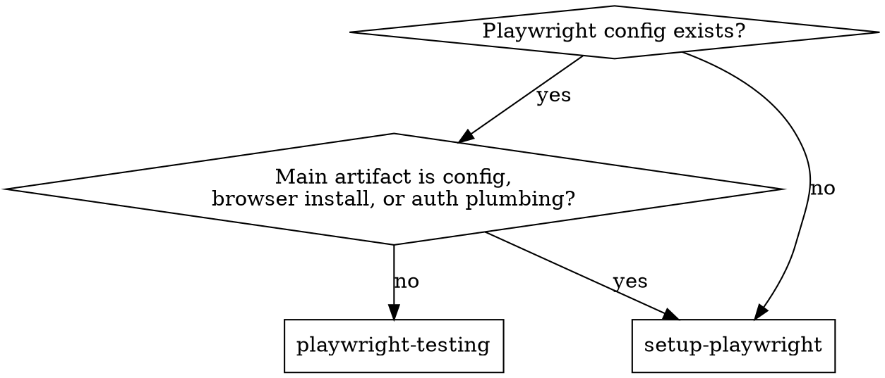

# Playwright Testing

Generate tests from evidence, not guesswork: inspect the product, name the
claim, choose the smallest durable test structure, then harden until reruns are
boring.

**Playwright tests are checks** — automated pass/fail assertions. **Testing
as investigation** — charters, heuristics, oracles under stress, edge-case
discovery, perspective rotation — is upstream. Compose with `tester-mindset`
when strategy, risk framing, or the shape of the unknown dominates. This
skill tells you how to build durable checks; it does not replace the
thinking that decides which checks to build.

## When To Use

- writing, reviewing, or hardening Playwright E2E specs in a working harness
- debugging flaky specs, brittle locators, or tests that only pass on retry
- exploring a running app with `playwright-cli`, UI Mode, or `codegen`
- adding responsive, visual, or accessibility coverage against existing config
- choosing between page objects, fixtures, parameterization, or route mocks

## Not For

- first-time Playwright install, browser install, or `playwright.config.*`
  authoring — route to `setup-playwright`
- creating the `auth.setup.ts` + setup-project wiring — route to
  `setup-playwright` (using that wiring *in tests* belongs here)
- test-strategy or edge-case discovery for a feature with no named claim —
  compose with `tester-mindset` first

## Routing Flowchart

## Reference Map

- [references/testing-patterns.md](references/testing-patterns.md) — page
  objects, fixtures, auth usage, parameterization, route/HAR mocking,
  `test.step()`, multi-role flows.
- [references/browser-boundaries.md](references/browser-boundaries.md) —
  iframes, popups, downloads, dialogs, request-fixture polling, clock,
  accessibility.
- [references/playwright-cli-investigation.md](references/playwright-cli-investigation.md)
  — snapshot discipline, sessions, saved state, CLI tracing, `--debug=cli`.
- [references/debugging-and-visual-qa.md](references/debugging-and-visual-qa.md)
  — runner-side reruns, trace/report triage, `codegen` / UI Mode, visual QA.

## Adjacent Skills

- **tester-mindset** — required upstream when the claim is vague, strategy
  is contested, or edge cases are the main job. Its claim/oracle/apparatus/
  residual-risk vocabulary is assumed here.
- **ui-guidance** or **ui-design-guidance** — when visual, responsive,
  accessibility, or frontend-polish is the claim.
- **security** and **security-identity-access** — when browser tests cross
  auth, recovery, session, tenant, permission, or callback-origin boundaries.
- **setup-playwright** — when work is actually harness, install, or auth
  plumbing rather than spec authoring.

## Core Workflow

1. **Name the claim and pick the right layer.** State the user flow,
   contract, oracle, stakeholders, and cost of being wrong before writing
   code. A bank's checkout suite should be scoped differently from a
   side-project's — context drives how much evidence is enough. Keep E2E
   thin: protect critical journeys, push detail to unit, integration, or
   contract tests when they can prove it more cheaply.
2. **Inspect the apparatus.** Read `playwright.config.*`, fixtures, page
   objects, data helpers, auth setup, package scripts, CI hints, reporters,
   and neighboring specs. Note `baseURL`, browser projects, retries,
   `storageState`, `webServer`, output dirs, `testIdAttribute`, dependencies,
   and trace/video policy.
3. **Explore before coding.** When behavior is unknown, use `playwright-cli`
   against the running app. Snapshot before interacting so refs stay stable;
   re-snapshot after navigation. Scope large pages with `--depth` or a
   section target. If a locator stays ambiguous, use UI Mode, the Inspector,
   or `codegen` to generate and refine before writing the test. Use named
   sessions and `state-save` / `state-load` when multi-role comparison or
   preserved auth materially changes the investigation.
4. **Enumerate cases.** List checks before implementing them. Decide whether
   a plain spec suffices or repetition justifies page objects, fixtures,
   reused auth, parameterization, or controlled mocks. Add at least two
   off-happy-path cases.
5. **Write deterministic specs.** Follow the repo's language and neighbors.
   Default to TypeScript `@playwright/test` only when no stronger local
   signal exists. Use user-facing locators, web-first assertions, isolated
   data, `test.step()` for multi-phase flows, fixtures over broad
   `beforeEach`, and a setup project plus `storageState` for reusable auth.
6. **Run narrow, then harden.** Run one file and one browser project first
   with `--reporter=line` or `dot`. Open the trace or report before
   guessing. Reproduce flakes with `--workers=1`, headed mode, `--debug`,
   or UI Mode. Once green, harden with `--repeat-each 10` (or `5` when
   runtime is expensive), then broaden to the browser/device matrix only
   when the claim needs it.
7. **Interpret narrowly.** Report what the tests prove, what they only
   suggest, what was intentionally mocked or excluded, and the next
   higher-fidelity probe if material risk remains.

## Preflight

Testing-phase only. If the blocker is port binding, sandbox, build locks, or
missing browsers, route to `setup-playwright`.

1. Confirm working directory, app root, and target spec path. Prefer exact
   paths or `--grep` over broad globs during triage.
2. Validate CLI flags against the installed Playwright version before batch
   runs.
3. Confirm trace, screenshot, or report paths exist before reading them. If
   missing, inspect the latest `test-results/` directory first.
4. Raise timeouts only on the affected test or step, never reflexively
   globally.

## Locator Priority

Walk top-down; stop at the first that fits:

1. `getByRole`
2. `getByLabel` / `getByPlaceholder`
3. `getByText` / `getByAltText` / `getByTitle`
4. `getByTestId`
5. refine with `locator.filter({ hasText })` or `filter({ has: ... })`
6. CSS or XPath only as a documented last resort

## Test Quality Rules

These are Playwright-grounded heuristics, not context-free laws. Each rule
earns its place because a common failure mode hides behind its violation.
Applied under pressure without thought they become ritual; applied with
context they prevent real harm. If a rule conflicts with the named claim,
state the conflict explicitly and choose deliberately rather than following
by rote.

- Every test has a real action or observation and at least one meaningful
  assertion against product behavior. One behavior per test; split if the
  name needs "and".
- After UI interactions, assert on UI change, URL change, persisted
  user-visible state, or another observable contract. Network waits are a
  means, not the oracle.
- Use web-first assertions (`toBeVisible`, `toHaveText`, `toHaveURL`,
  `toHaveCount`, `toHaveValue`). Do not wrap a one-shot async read in
  `expect()`: prefer `await expect(locator).toBeVisible()` over
  `expect(await locator.isVisible()).toBe(true)` — the first polls, the
  second is a single-shot race.
- Prefer `fill()` for ordinary text entry; use `pressSequentially()` only
  when the app genuinely reacts per keystroke.
- Playwright locators are strict for single-target actions. Refine ambiguous
  locators with chaining, filtering, or an explicit contract rather than
  defaulting to `first()` or `nth()`.
- Never use `waitForTimeout` as synchronization. Wait on user-visible state,
  URL change, or request completion that gates a visible contract.
- For eventual consistency, use `expect.poll(...)` or
  `expect(...).toPass({ timeout })`. `toPass()` defaults to *zero* timeout —
  always pass an explicit one.
- For time-dependent UI, use `page.clock` when the browser clock is the
  claim; do not wait in real time.
- Keep tests independent: no order dependence, hidden shared state, or reuse
  of mutable backend data unless a fixture owns isolation.
- Use deterministic data; derive uniqueness from worker, project, or explicit
  seed, and clean up backend-persisted state.
- Prefer user-like interactions. Avoid `force: true` unless you can explain
  why the user can still perform the action.
- Use tags and annotations intentionally: `@smoke`, `@vrt` for filtering,
  `test.slow()` for legitimate long flows, `test.fail()` for expected
  failures, `test.fixme()` for unstable or wasteful cases.
- Introduce page objects only when flows or locator groups repeat across
  files. Do not wrap one-off tests in a page-object layer by default.
- Prefer fixtures over broad `beforeEach` / `afterEach` for explicit,
  composable, or worker-scoped setup.
- Use the built-in `request` fixture for API seeding or backend verification;
  it inherits `baseURL` and shared headers.
- Parameterize repeated scenarios at test or project level; keep hooks
  outside per-case loops so they run once, not once per generated case.
- Reuse authentication via setup project + ignored `storageState` unless the
  login UI itself is the claim.
- For multiple authenticated roles in one test, use separate contexts with
  separate storage states, not a shared page.
- For popups, downloads, dialogs, file choosers, or other browser events,
  start `waitForEvent(...)` before the triggering action.
- Use `frameLocator()` for iframes.
- Mock only third-party or intentionally injected failure boundaries. Do not
  mock the UI behavior being verified. When mocking in apps with service
  workers, set `serviceWorkers: 'block'`.
- Use visual snapshots only when rendering itself is the claim and the
  environment can keep baselines stable.
- For accessibility claims, combine automated checks with manual review —
  ARIA snapshots and axe-style scans are evidence, not signoff.
- Default smoke to one browser project first. Broaden only when the claim
  needs it.
- If a behavior is genuinely hard to test — auth coupled to
  `sessionStorage`, rendering that depends on real time, state mutating in
  uncontrolled side effects, locators that can only be reached via a
  screenshot — flag it as app-side design feedback, not only a test-side
  workaround. `addInitScript`, `page.clock`, explicit test ids, and
  similar tools are workarounds, not endorsements of the underlying
  coupling.

## Determinism Policy

Nondeterminism is a risk to expose or control, not a quality goal.

- Default CI retries to `2`, local retries to `0`.
- A test that passes only on retry is a flaky result, not a clean pass.
- Capture trace, screenshot, or video on the first retry so failures produce
  evidence.
- Triage order: reproduce one failing test with `--workers=1`, open the
  artifact, fix the determinism root cause, rerun the targeted suite, then
  broaden.
- Keep randomized or exploratory probes out of the normal blocking suite. If
  the user explicitly wants them, use an explicit seed and print it on
  failure.

## Stopping Rule

Stop adding tests when the claim has risk-appropriate evidence, remaining
uncertainty is named, and the next test would cost more than the confidence
it could add. When material risk remains but more authored coverage is
inefficient, escalate to monitoring, canary, staged rollout, or explicit
acceptance — do not inflate the suite as a substitute for that conversation.
"More tests" is not a universal answer; it is one of several instruments.

## Failure-Class Triage

Before blaming the product, rule out environment:

- `EADDRINUSE` on the Playwright `webServer` port
- missing spec or result paths due to stale assumptions
- shell-glob expansion failures on bracketed route segments such as `[id]`
- service workers silently swallowing `page.route()` interception
- missing browser binaries or blocked install steps

These are setup bugs, not product bugs. Fix them before weakening assertions.

### Passes Locally, Fails In CI

A different failure class from flakiness. Before assuming a real defect:

- **Worker count:** CI usually runs `workers: 1`. Shared-state bugs surface
  serially in CI but hide behind parallelism locally. Re-run locally with
  `--workers=1`.
- **Viewport and device:** local dev likely uses default desktop; the CI
  project may emulate mobile. Check the project that actually failed.
- **Auth state:** `storageState` captured locally may not match the CI auth
  provider. If state is path-dependent, the setup project must run in CI
  too. UI Mode does not run setup projects by default.
- **`webServer` reuse:** local `reuseExistingServer: true` may be serving a
  manually-started dev build with uncommitted changes. CI builds from clean.
- **Time, locale, timezone:** CI often runs UTC and `en-US`. If the test
  reads formatted output, pin `locale` and `timezoneId` via `test.use()`.
- **Headless vs headed:** features gated on `window.devicePixelRatio`, input
  modality, or focus behavior may differ. Repro with `--headed` disabled.
- **Artifact download:** pull the CI trace and open it locally before
  adding retries or widening assertions.

## Weak Test Detector

Reject or rewrite tests with:

- actions but no meaningful assertion
- truthiness-only checks where a specific URL, text, count, state, or value
  matters
- generated code pasted in without exploration or oracle design
- sleeps or fixed waits hiding race conditions
- selectors that break on harmless layout or class-name changes
- retries used to normalize flakes instead of exposing them
- UI login in every test when reusable auth state would prove the same thing
- `toPass()` without an explicit timeout
- mocking the system under test instead of external boundaries
- schema-success-only assertions that never inspect parsed values

## Rationalization Table

Common excuses and the reality they obscure:

| Excuse | Reality |
| --- | --- |
| "Just add a 500ms `waitForTimeout` to unblock CI." | Fixed sleeps hide races; the next test author inherits the flake. Wait on a user-visible state change or an explicit signal. |
| "The locator matches two elements — I'll use `.first()`." | `.first()` freezes an ambiguity into the test. Refine with `filter`, role, text, or an explicit test id. |
| "It passes on the retry so it's fine." | Passing only on retry is a flaky result. Treat the first-attempt failure as the signal. |
| "Logging in through the UI in every test is simpler." | Simpler to write, noisier to debug, and an expensive flake surface. Use setup project + `storageState` unless login UI is the claim. |
| "Just mock the widget under test so we don't need the backend." | That's mocking the SUT. Mock external boundaries only; if the backend is the problem, fix the boundary or use the `request` fixture. |
| "Raise the global timeout to 60s so nothing times out." | Global timeouts normalize slow failure modes. Raise on the affected test or step, and only for a named reason. |
| "The trace is large, I'll skip opening it." | The trace is faster than guessing. Open it before weakening assertions. |
| "I'll `test.skip()` this until the product team fixes it." | Skip without a linked issue rots. Use `test.fixme()` with a referenced bug, or `test.fail()` to keep executing the expected-failure path. |
| "CI is different — the test is fine locally." | "Different" is a hypothesis. Walk the CI-vs-local triage list before calling it a CI-only issue. |

## Visual QA

When the claim is visible, run a dedicated visual pass:

- Inspect the state where the user *perceives* the change, not only the
  final DOM.
- Check the initial viewport before scrolling.
- Exercise the densest realistic state you can reach, not only empty or
  loading states.
- Distinguish presence from perceptibility: clipped, occluded, low-contrast,
  or overlapping UI is a failure.
- Prefer viewport or element screenshots for signoff; treat full-page
  screenshots as debugging artifacts.
- Compare desktop and mobile viewports when layout is the claim; expand to
  Firefox or WebKit only when browser evidence is needed.

Details and snippets live in
[references/debugging-and-visual-qa.md](references/debugging-and-visual-qa.md).

## Output Shape

When recommending or delivering tests, include:

- **Claim:** behavior or risk being tested
- **Cases:** checks implemented or proposed
- **Oracles:** how failures are recognized
- **Evidence:** commands run, artifacts used, and result
- **Residual risk:** what passing still does not prove

## Examples

- `Use playwright-cli to explore checkout and generate tests.` → inspect
  the checkout surface, name checkout claims, write deterministic specs for
  success and validation failures, run with `--reporter=line`.
- `Review these Playwright tests for flakiness.` → look for weak
  assertions, sleeps, shared state, brittle selectors, retry-masked
  failures, and environment mistakes before calling anything a product bug.
- `Add responsive coverage for this settings page.` → explore desktop and
  mobile viewports, assert stable navigation and accessible controls, use
  screenshots only when rendering itself is the contract.
- `Install Playwright in this repo.` → route to `setup-playwright`; return
  here only after the harness exists and the job is authoring or hardening
  tests.

## Maintainer Notes

For doc refreshes, trigger audits, and pressure-test scenarios, see
[references/coverage-and-validation.md](references/coverage-and-validation.md).
