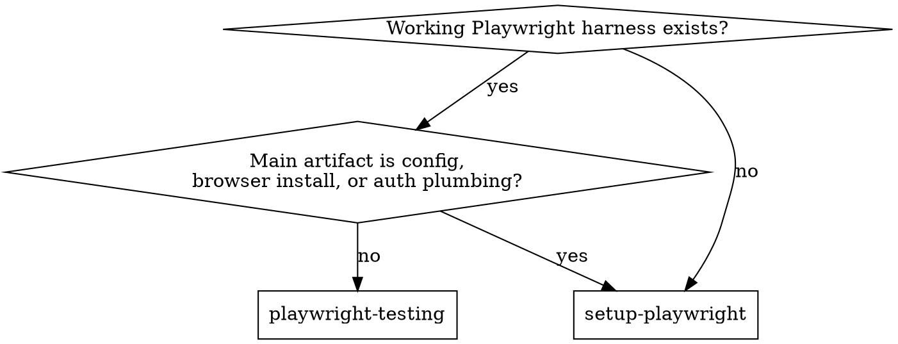

# Setup Playwright

Build the smallest reliable Playwright harness that fits the repository already
in front of you.

This is a system skill: it leaves behind repo-owned test setup, config, and a
starter check. Day-to-day spec authoring belongs to `playwright-testing`.
Preserve the repo's existing Playwright ecosystem shape instead of forcing
Node `@playwright/test` into Python, .NET, or Java repos that already have a
clear runner choice.

## Runner Choice

Use the repo's strongest local signal:

- Node / TypeScript / JavaScript repo with no stronger signal:
  `@playwright/test`
- Python repo with pytest usage: Playwright Pytest
- .NET repo: existing MSTest, NUnit, or xUnit project plus Playwright's
  .NET install flow
- Java repo: existing JUnit or TestNG module plus Maven or Gradle Playwright
  wiring

## When To Use

- no working Playwright harness exists in the target package or test project
- an existing config is broken, incomplete, or moved packages
- adding reusable auth or storage-state wiring for login reuse — even if
  specs already exist (config-shape changes belong here)
- adding `webServer`, browser install, browser projects, `storageState`,
  sharding, or CI reporter setup
- placing Playwright correctly in a monorepo or alongside existing unit tests

## Not For

- writing, reviewing, or hardening specs once the harness works — route to
  `playwright-testing`
- debugging flaky specs, brittle locators, or test behavior — route to
  `playwright-testing`
- product exploration with `playwright-cli`, UI Mode, or `codegen` — route
  to `playwright-testing`

## Routing Flowchart

## Adjacent Skills

- **project-config-and-tests** — when the work changes config shape,
  defaults, test layout, or deterministic coverage expectations.
- **coding-guidance-python**, **coding-guidance-cpp**, **coding-guidance-bash**,
  or another principle skill when setup needs non-trivial code in that
  language.
- **ui-guidance** or **ui-design-guidance** — when the starter smoke test
  must validate UI behavior, accessibility, responsiveness, or visible
  layout.
- **playwright-testing** — once the harness exists and the job becomes test
  design, visual QA, or flake review.

## Reference Map

- [references/ecosystem-patterns.md](references/ecosystem-patterns.md) —
  choose the correct Playwright harness shape for Node, Python, .NET, or
  Java; preserve the repo's runner and install commands.
- [references/auth-and-ci-patterns.md](references/auth-and-ci-patterns.md) —
  Node Playwright Test patterns for `auth.setup.ts` + setup-project wiring,
  API login, one account per worker, CI posture, sharded reports.
- [references/browser-and-config-patterns.md](references/browser-and-config-patterns.md)
  — Node Playwright Test defaults for config scope, projects/dependencies,
  browser and channel selection, emulation, timeouts, reporters, `webServer`.

Reference naming note:

- `auth-and-ci-patterns.md` and `browser-and-config-patterns.md` keep their
  historical names, but they are intentionally Node Playwright Test-only.
- Keep truly cross-ecosystem guidance in
  `references/ecosystem-patterns.md` rather than widening the Node helpers
  until they become ambiguous.

## Core Workflow

1. **Inspect the repo first.** Read `package.json`, `pyproject.toml`,
   `.csproj`, `pom.xml`, `build.gradle`, lockfiles, workspace config,
   existing test folders, Playwright config, CI files, ignore files, app
   docs, route files, and any auth or test-id signals. Identify the package
   manager, app root, likely test language, start command, base URL, auth
   flow, configured `testIdAttribute`, browser or device expectations, and
   whether this is a monorepo or a migration from another E2E tool.
2. **Resolve the five setup inputs from repo truth.** Ask the user only for
   what the repo does not already answer:
   - **Target URL:** local base URL for `webServer`, or the external URL
     the harness will hit.
   - **Auth model:** none, fixture-based login, or runner-native reusable
     auth plus ignored `storageState`.
   - **Test data:** ephemeral per-test, shared seed, backend reset hook, or
     deliberately mocked external boundary.
   - **Browser scope:** Chromium-only to start, or a broader matrix.
   - **CI posture:** local only, smoke on pull requests, or broader
     regression cadence.
3. **Choose the package boundary and setup path.** If Playwright already
   exists, extend or repair instead of re-scaffolding. In monorepos,
   preserve the correct package boundary; ask before adding dependencies
   when multiple packages are equally plausible. Preserve the repo's
   existing language and runner. Use the repo's native Playwright stack:
   `@playwright/test` for Node, Playwright Pytest for Python, Playwright's
   base classes and `playwright.ps1` flow for .NET, and the repo's chosen
   Java test framework with Playwright dependencies and CLI wiring for
   Java. If no stronger signal exists, default to Node Playwright Test for
   repo-owned E2E. Do not switch to the raw `playwright` library unless
   the user explicitly wants library automation outside the test runner.
4. **Place files conservatively.** Follow existing test layout. Otherwise
   use the ecosystem's normal layout: Node commonly uses `tests/`, `e2e/`,
   or `tests/e2e/`; Python follows the repo's `tests/` and pytest config
   shape; .NET and Java should stay inside the existing test project or
   module instead of inventing a parallel Node-style tree.
5. **Configure the runner in the repo's ecosystem.** For Node, add the
   smallest durable `playwright.config.*` that fits: `testDir`,
   `use.baseURL`, CI-safe `forbidOnly`, `retries: process.env.CI ? 2 : 0`,
   `workers: process.env.CI ? 1 : undefined`, reporter defaults that fit
   agent and CI use, `trace: 'on-first-retry'`,
   `screenshot: 'only-on-failure'`, and `webServer` when the app has a
   stable start command. Preserve or define `testIdAttribute` when the
   repo uses an explicit test-id contract. For Python, preserve pytest
   config and CLI defaults instead of fabricating `playwright.config.ts`.
   For .NET, preserve the existing test framework and use runsettings or
   launch options rather than Node config files. For Java, preserve the
   repo's test framework and build-tool wiring rather than introducing a
   Node-style runner. Enable `fullyParallel` only when the suite is truly
   isolation-safe. When many tests need the same authenticated user, use
   ignored `storageState` or the closest ecosystem-native equivalent.
6. **Add supporting structure only when repetition justifies it.** Create
   fixtures, page objects, or setup helpers when flows or setup repeat.
   Prefer fixtures over broad `beforeEach`. Use route mocking only for
   external or intentionally injected boundaries, and block service
   workers when they would swallow `page.route()`. In Node Playwright Test,
   use projects for meaningful browser, device, environment, or
   setup-dependency differences and `test.use()` for narrower per-file or
   per-`describe` overrides such as locale, timezone, permissions, color
   scheme, or viewport. In other ecosystems, use the runner's equivalent
   local override mechanism instead of inventing Node abstractions.
7. **Preserve repo conventions and CI posture.** Add scripts only in the
   style the repo already uses. Keep Playwright as a separate E2E
   entrypoint unless the repo already treats it as default. Default CI
   posture is a smoke gate on pull requests; a broader matrix only when
   the repo or user needs that evidence.
8. **Add one starter smoke test.** Cover a stable, low-cost product path:
   app loads, a landmark or heading is visible, and one core navigation
   or interaction works. Use web-first assertions and user-facing
   locators.
9. **Validate narrowly.** Run the preflight below, install required
   browsers when needed, then run the smallest meaningful runner command
   for the changed setup. Start with one file, one module, or one browser
   target and the narrowest useful output for that ecosystem. `--list`
   proves discovery only; run at least one real test when the environment
   allows it.
10. **Report the contract.** State the workspace root or package
    boundary, package manager, config path, test directory, scripts
    added, validation command, and any setup assumptions the next agent
    or developer must know.

## Validation Preflight

Before the first Playwright-backed test invocation:

- **Bind host and port:** confirm `127.0.0.1` (unless the environment
  requires another bind) and verify the port is free. Do not let
  `webServer` race a manually started dev server on the same port.
- **Sandbox escalation:** if a bind fails with `EPERM` or `EACCES`,
  escalate rather than retry-loop.
- **Build-lock hygiene:** clear stale build locks such as `.next/lock`
  only after confirming no active owner remains.
- **Artifact paths:** confirm the ecosystem's artifact directories
  (for example `test-results/` or `playwright-report/` in Node setups) and
  any auth-state path are writable and ignored when appropriate.
- **Browser install path:** confirm the needed browser binaries are
  available, then install only what the repo's scope actually requires.
  Re-run browser install after Playwright version upgrades.

## Decision Rules

**Boundary and scope**

- Do not overwrite existing Playwright config, tests, snapshots, or
  scripts.
- Keep E2E thin. Set up the harness to protect critical journeys, not to
  replace lower-level testing.
- Ask before choosing a package boundary when a monorepo has multiple
  plausible app packages and no clear target.
- These skills target Playwright-backed E2E harnesses. Component Testing,
  Chrome extension testing, and WebView2 automation need specialized
  setup; do not silently fold them into the default web-app harness.
- Do not scaffold Playwright Test Agents with
  `npx playwright init-agents` unless the user explicitly wants repo-owned
  planner/generator/healer definitions.
- Do not fabricate `playwright.config.ts`, `auth.setup.ts`, or Node package
  scripts inside Python, .NET, or Java repos just to imitate the Node docs.

**Package manager and ecosystem**

- Prefer the repo's existing package manager and lockfile. Do not
  introduce a second package manager.
- Treat Node Playwright Test, Playwright Pytest, Playwright .NET base
  classes, and Java test-framework integrations as first-class. Use Node
  `@playwright/test` only when the repo is already Node-based or no
  stronger stack signal exists.

**Install hygiene**

- Keep Playwright and its browser binaries in sync. After updating the
  package, rerun the Playwright install command for the browsers you
  actually need.
- Do not add `@playwright/cli` as a repo dependency just to investigate
  the app. Keep `playwright-cli` as agent tooling unless the user
  explicitly asks for reusable repo-owned browser automation.

**Config shape**

- In Node Playwright Test, prefer `webServer` in config over telling users
  to start the app manually, unless the repo's start process is
  intentionally external.
- In Node Playwright Test, prefer project dependencies over `globalSetup` /
  `globalTeardown`. Use global hooks only for genuinely non-fixture
  bootstrap or environment-variable handoff outside the normal runner
  model.
- In Node Playwright Test, use `test.use()` or
  `test.describe(() => test.use(...))` for narrow locale, timezone,
  permissions, color-scheme, or viewport overrides instead of adding
  another whole project.
- Enable `fullyParallel` only when tests are genuinely order-independent;
  it amplifies shared-state bugs.
- Configure Chromium-only validation first when speed or dependency cost
  is the constraint. Default to bundled Chromium; opt into branded Chrome
  or Edge channels only when stable-channel parity, codec behavior, or a
  browser-policy environment actually requires it.
- If the suite is TypeScript, remember Playwright transpiles TS but does
  not type-check it. Preserve or add a separate `tsc --noEmit` step when
  the repo expects type safety.

**Auth plumbing**

- In Node Playwright Test, use a setup project plus ignored `storageState`
  when reusable login is needed. In other ecosystems, keep the same intent
  but wire it through the runner's fixtures, helpers, or base classes.
- If the app stores required auth state in `sessionStorage`, inject it with
  `addInitScript` or the closest ecosystem-native equivalent.
- UI Mode does not run setup projects by default in Node Playwright Test.
  Document how auth state is refreshed manually when it expires.

**Artifacts and hygiene**

- Keep authentication state, traces, videos, screenshots, and generated
  reports out of git unless the repo has a deliberate artifact policy.
- Do not add visual-regression baselines by default. Add them only when
  rendering is itself a maintained contract.
- Do not add fixed sleeps, broad CSS selectors, or assertion-free
  starter tests. The starter must use web-first assertions.
- Do not invent CI, deployment, or release claims. Add CI workflow
  changes only when the task explicitly includes CI or the repo already
  has a clear CI pattern to extend.

## Rationalization Table

Common setup shortcuts and expected pushback live in
[references/pressure-tests.md](references/pressure-tests.md). Load that
reference when reviewing a proposed harness shortcut or revising the skill's
trigger and setup rules.

## Setup Checklist

- package manager, workspace root, and target package boundary are
  identified
- the five setup inputs (URL, auth, data, browsers, CI) are resolved
- Playwright dependency and browser install path fit the repo
- runner config has an explicit test location, base URL or startup
  contract, retry policy, and artifact or reporting shape
- CI worker count and trace policy are explicit
- `fullyParallel`, if enabled, is justified by actual test isolation
- selector or test-id contract is explicit when the repo uses one
- auth, if any, uses a runner-native reusable pattern
- broad-vs-local override scope is chosen deliberately for the active
  runner
- if CI sharding is in scope, reporter and merge strategy are explicit
- if the runner transpiles but does not type-check TypeScript, separate
  typecheck behavior is explicit
- commands, scripts, or build-tool wiring match existing naming
  conventions
- first test uses role, label, text, alt text, or test id locators
- generated artifacts and auth state are ignored or already covered
- validation ran, or the blocker is stated with the next exact command

## Examples

- `Set up Playwright tests in this fresh Next.js repo.` → inspect package
  scripts, add Playwright Test with the repo's package manager, configure
  `webServer` on `127.0.0.1:<port>`, create a starter smoke test, run it
  in Chromium with `--reporter=line`.
- `Set up Playwright browser tests in this Python repo.` → preserve pytest,
  add Playwright Pytest and browser install commands, keep config in pytest
  files or fixtures instead of inventing `playwright.config.ts`, validate
  with a narrow `pytest` run.
- `Add an E2E harness to this app without disturbing unit tests.` → keep
  the existing unit-test layout intact, add Playwright at the repo's
  native test boundary, keep its commands separate from unit-test entry
  points, and validate only the new harness.
- `Add Playwright coverage to this .NET test project.` → preserve MSTest,
  NUnit, or xUnit, wire browser installation through `playwright.ps1`,
  keep storage-state paths and runsettings in the test project, validate
  with `dotnet test`.
- `Add Playwright coverage to this Java Maven module.` → preserve JUnit or
  TestNG, wire browser installation and Playwright dependencies through
  Maven or Gradle instead of Node scripts, keep auth setup in Java helpers,
  and validate with the module's existing test command.
- `Fix this broken playwright.config.ts after a package move.` → repair
  paths, base URL, scripts, and project config without re-scaffolding or
  replacing existing specs.
- `Add login reuse so tests do not log in through the UI every time.` →
  add the runner's reusable auth mechanism with ignored `storageState`,
  document how the state is refreshed, and keep the login UI only in the
  tests where login itself is the claim. In Node this commonly means a
  `setup` project; in other ecosystems use fixtures, helpers, or base
  classes. Handled here because it changes harness shape even when specs
  already exist.

## Maintainer Notes

For doc refreshes, trigger audits, and pressure-test scenarios, see
[references/coverage-and-validation.md](references/coverage-and-validation.md).
